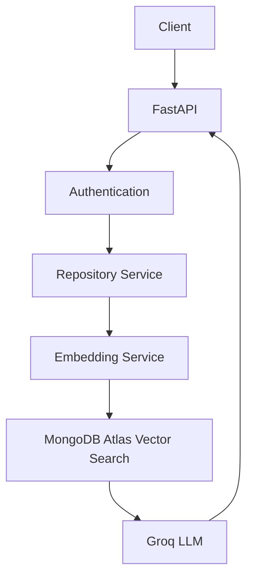
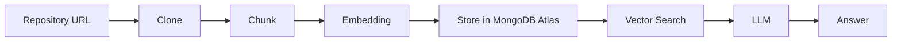

# AI Repository Assistant

## Project Overview

AI Repository Assistant is a backend service that lets you point it at a GitHub repository and then ask natural-language questions about that codebase. It clones the repository, breaks the source down into semantically meaningful chunks, embeds those chunks, and stores them in a vector index. When you ask a question, it retrieves the most relevant chunks for *that specific repository* and uses a large language model to answer strictly from that retrieved context — a **Retrieval-Augmented Generation (RAG)** pipeline, scoped per user and per repository.

## Features

- JWT Authentication (access + refresh tokens)
- Repository Management (create, track status)
- GitHub Repository Cloning
- Code Chunking (Python AST-based function/class extraction)
- Gemini Embeddings
- MongoDB Atlas Vector Search
- Secure Repository-scoped RAG (users can only query repositories they own)
- Semantic Code Search

## Tech Stack

**Backend**
- FastAPI
- Motor (async MongoDB driver)
- MongoDB Atlas (Vector Search)
- Groq (LLM inference)
- Gemini (embeddings)
- GitPython (repository cloning)

## Architecture



## RAG Workflow



## Folder Structure

```
backend/
├── app/
│   ├── ai/
│   │   ├── embeddings/     # Embedding provider implementations + factory (Gemini)
│   │   └── llm/            # LLM provider implementations + factory (Groq)
│   ├── api/routes/         # FastAPI route definitions
│   ├── config/             # Settings (pydantic-settings)
│   ├── database/           # Shared Motor client/database instance
│   ├── dependencies/       # FastAPI dependencies (e.g. get_current_user)
│   ├── exceptions/         # Custom exception types
│   ├── models/             # Internal domain models (Pydantic)
│   ├── repositories/       # MongoDB data access layer
│   ├── schemas/            # Request/response schemas (Pydantic)
│   ├── serializers/        # Convert DB documents to response schemas
│   ├── services/           # Business logic / orchestration
│   ├── utils/              # Shared helpers (JWT, password hashing, paths)
│   └── main.py             # FastAPI app entrypoint
├── scripts/manual/         # Manual dev scripts (not part of the app)
└── requirements.txt
```

## Environment Variables

| Variable | Description |
|---|---|
| `APP_NAME` | Application name |
| `APP_VERSION` | Application version |
| `DEBUG` | Enable debug mode |
| `MONGODB_URI` | MongoDB Atlas connection string |
| `DATABASE_NAME` | MongoDB database name |
| `JWT_SECRET_KEY` | Secret key used to sign JWTs |
| `JWT_ALGORITHM` | JWT signing algorithm (e.g. `HS256`) |
| `ACCESS_TOKEN_EXPIRE_MINUTES` | Access token lifetime in minutes |
| `REFRESH_TOKEN_EXPIRE_DAYS` | Refresh token lifetime in days |
| `REPOSITORIES_PATH` | Local path where cloned repositories are stored |
| `LLM_PROVIDER` | LLM provider to use (`groq`) |
| `GROQ_API_KEY` | Groq API key |
| `GEMINI_API_KEY` | Gemini API key |
| `EMBEDDING_PROVIDER` | Embedding provider to use (`gemini`) |

## Installation

```bash
git clone https://github.com/safal45/AI_Repo_Assistant.git
cd AI_Repo_Assistant/backend
python -m venv .venv
source .venv/bin/activate
pip install -r requirements.txt
cp .env.example .env   # then fill in real values
```

## Running Locally

```bash
uvicorn app.main:app --reload
```

The API will be available at `http://127.0.0.1:8000`. Interactive docs at `http://127.0.0.1:8000/docs`.

## API Endpoints

| Method | Endpoint | Description |
|---|---|---|
| GET | `/health` | Health check |
| POST | `/auth/register` | Register a new user |
| POST | `/auth/login` | Log in and receive access/refresh tokens |
| GET | `/auth/me` | Get the current authenticated user |
| POST | `/auth/refresh` | Exchange a refresh token for a new access token |
| POST | `/repositories` | Register and clone a new repository |
| GET | `/repositories/{repository_id}/scan` | List files in a cloned repository |
| GET | `/repositories/{repository_id}/chunks` | Parse a repository into code chunks |
| POST | `/repositories/{repository_id}/index` | Persist parsed code chunks for a repository |
| POST | `/repositories/{repository_id}/embed` | Generate embeddings for a repository's chunks |
| POST | `/repositories/{repository_id}/chat` | Ask a question about a repository (RAG) |

## Future Roadmap

The following are planned but **not yet implemented**:

- Conversation Memory
- Streaming Responses
- Tool Calling
- AI Agents
- LangGraph
- Multi-Agent Workflows

## License

MIT — see [LICENSE](LICENSE).
